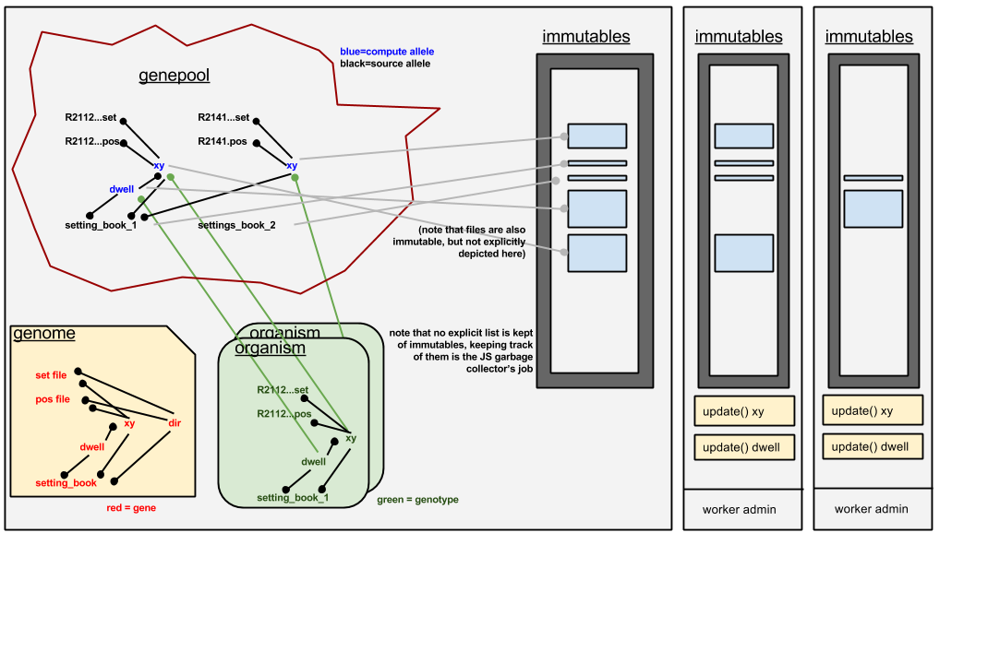

## Genepipe

_Genepipe_ is a module created specifically for this application to manage data sources and computation pipeline.  The module itself is designed to be generalised, i.e. it doesn't contain anything specific to this applciation, but it's design is entierly tuned for the needs of this application.

This document explains the structure of _genepipe_ using examples from the main application.



The idea is that the tilewall and individual tiles in the grabbed panel are _organisms_.  All _organisms_ share the same basic _genome_, but they can have different _alleles_ for each _gene_ and they may omit _genes_ if they wish. Note that _allele_ isn’t quite the right term as the value of many of the _alleles_ is not fixed; think of each _allele_ as a distinct version of their _gene_, but one that can evolve over time without losing its original _allele_-identity.  Given that _alleles_ can change, we have to refer to the _value_ of an _allele_ at a given time, this _value_ data is treated as being immutable, meaning that when we want to change it we have to create a copy, modify the copy and then assign the copy back to the _allele_ as its new _value_.   

The _genome_ defines a non-circular set of dependencies between _genes_.  The _genepool_ contains the various _alleles_ in existence for each _gene_.  Some of the _alleles_ are treated as _sources_, meaning that they have no dependencies; this could mean that according to the _genome_, the _allele_’s _gene_ never has any dependencies, or it could mean that this particular _allele_ has been purposefully orphaned from its dependencies, so as to leave its _value_ frozen going forward. Note that some _source_ _alleles_ may evolve over time (as stated earlier), while others will never change (e.g. file _alleles_ dont change, but a mask or cut _allele_ might be altered by the user) . The second type of _allele_ is the _compute_ _allele_; these derive their values from the _alleles_ that they depend on (according to the _genome_), using the _update_ function defined for the given _gene_, within the _genome_ (they will thus be liable to change like the cut/mask _source alleles_ do).  The _genome_ defines a _render_ function for some of the _genes_, which _alleles_ can use when their _value_ changes - they hold a list of the _contexts_ required for rendering, one for each of the _organisms_ with that _allele_.


The _genome_ is defined using string identifiers for _genes_, but it is then compiled on page-load into a list with numerical _gene-ids_.  These _gene-ids_ are assigned such that every _gene_ has a higher _gene-id_ than all its dependencies.


_Genepipe_ contains the following classes: `gene`, `allele`, `genotype` and `immutable`. The `gene` instances exist in an array called the `genome`; the `alleles` for each `gene` exist in a list, which itself forms a list called the `genepool`; the `genotypes` exist in a list called an `organism`, of which there may be several.

**The `gene` class** has the following properties:

* `dependencies_direct` - array of `gene-ids` in ascending order
* `dependencies_full` - array of `gene-ids` in ascending order
* `update` - the function called when one or more of the dependencies are updated. It must update the 
		`value` of the `allele` or return `undefined` to indicate no update required
```javascript
function(a,b,c){  //a,b,c are the direct dependencies in the order originally defined ...
 if(update really needed) 		//...(not necessarily the same as ascending node-id order)
return G(a,b,c);
}
```
* `render` - the function which is called once for each item in the `context_list` array in an `allele` every time the `allele`'s `value` changes.
```javascript
function(val){ //val is the allele's value
  //do some plotting etc. here using the value
}
```
Note that only one value is passed to this function, so if it requires multiple values, an extra gene should be created as a proxy...that gene can combine multiple values into an object, which (like everything else) we then treat as a single immutable value in its own right.


**The ``allele`` class** has the following properties:

* `dependencies_direct` - array of references to `alleles`, one for each `gene-id` in the parent `gene`’s
 dependencies_direct array
* `dependants_direct` - array of references to alleles which currently use this allele
* `value` - reference to immutable value for the allele
* `context_list` - a list of contexts, with which to call the `gene`'s `render` function, i.e. `this=context_list[i]`
*	`pending_initilaisation` - a flag which is set to `true` until a context or dependency is added. This stops it being deleted before it’s been fully initialised.


**The `genotype` class** has the following properties:
* `allele` - the `allele` within the `genepool` currently assigned to this `gene` in the `organism` 
* `context` - stuff required for rendering to DOM etc. This is what you pass for adding/removing values
in the `allele.context_list`

**The `imutable` class** is used to manage copies of immutable data across muliple threads. It has the following properties:
* `data` - the value of the immutable which should be treated as immutable, or `undefined` if no data is present
* `id` - the unique identifier for the immutable, assigned on the main thread.
 

**Multi-threading**
A central feature of genepipe is that it uses webworkers to do multithreaded processing.  All the `update` functions are combined into one single string, together with some worker "admin" code, and then this string of code is launched multiple times as a pool of webworkers.  The admin code running on each worker is respondible for receiveing and managing a list of update requests from the main thread. One of the major complciations of this is the need to ensure that all the requierd immutables are present on those threads that need them and get deleted when they are no longer required.
